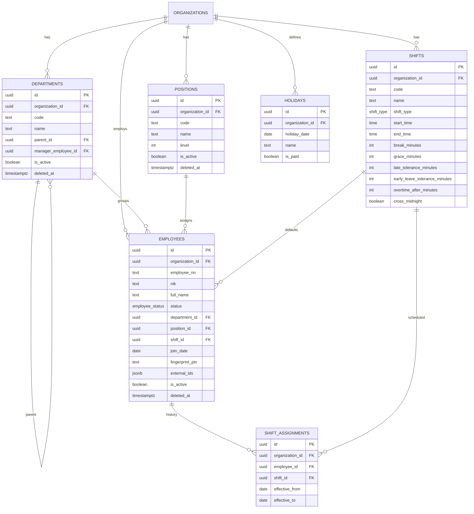
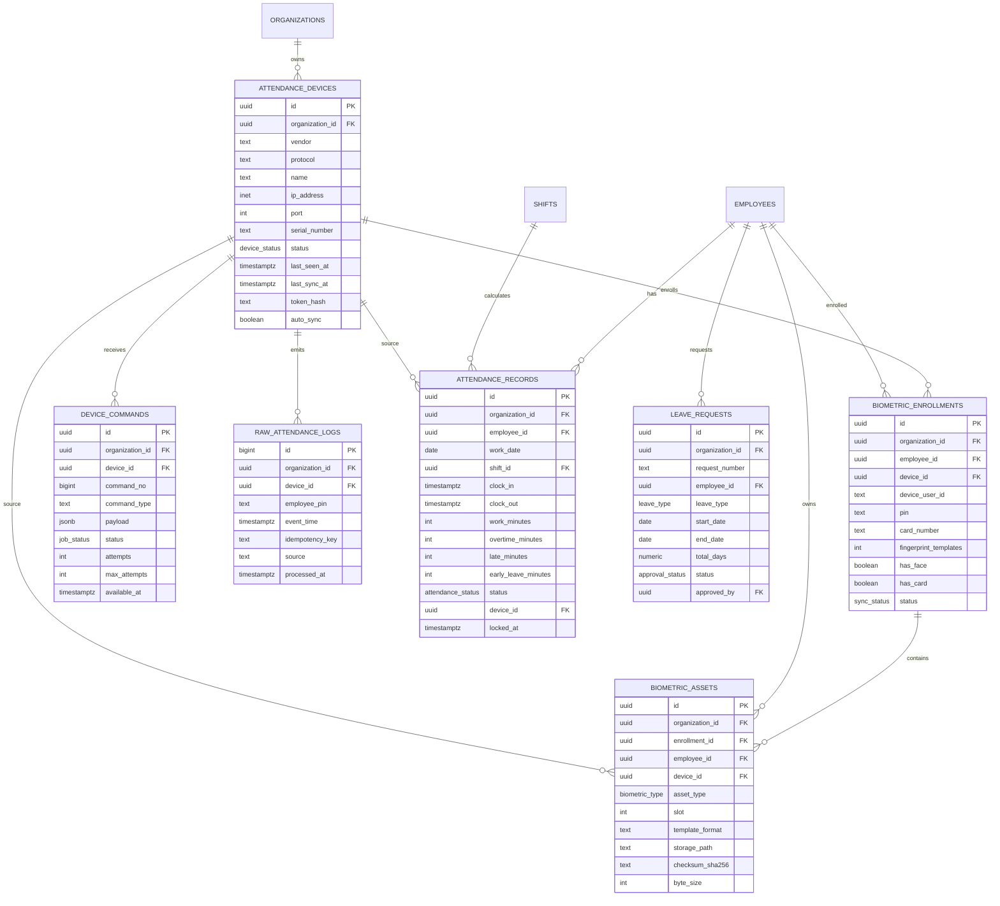
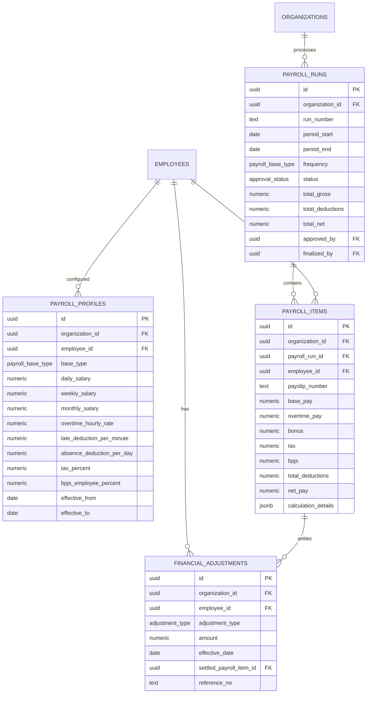
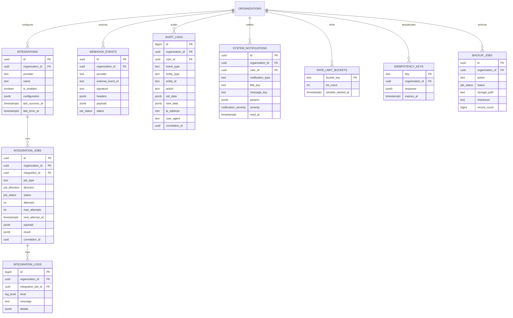

# Database ERD

Semua tabel bisnis utama memakai `organization_id` untuk isolasi tenant. Foreign key komposit organisasi digunakan pada relasi yang berisiko lintas tenant. Kolom audit waktu (`created_at`, `updated_at`) dipersingkat pada diagram.

## Organisasi dan akses

```mermaid
erDiagram
  AUTH_USERS ||--|| PROFILES : owns
  AUTH_USERS ||--o{ ORGANIZATION_MEMBERS : joins
  ORGANIZATIONS ||--o{ ORGANIZATION_MEMBERS : has
  ORGANIZATIONS ||--o{ ROLE_PERMISSIONS : configures
  ORGANIZATIONS ||--|| ORGANIZATION_SETTINGS : has
  ORGANIZATIONS ||--o{ ORGANIZATION_SECRETS : indexes
  ORGANIZATIONS ||--o{ NUMBER_SEQUENCES : numbers

  ORGANIZATIONS {
    uuid id PK
    text code UK
    text name
    text time_zone
    text locale
    boolean is_active
  }
  PROFILES {
    uuid id PK_FK
    text full_name
    text email
    text phone
    text avatar_path
  }
  ORGANIZATION_MEMBERS {
    uuid id PK
    uuid organization_id FK
    uuid user_id FK
    app_role role
    member_status status
    uuid department_id FK
    text_array permission_grants
    text_array permission_denials
  }
  ROLE_PERMISSIONS {
    uuid id PK
    uuid organization_id FK
    app_role role
    text_array permissions
  }
  ORGANIZATION_SETTINGS {
    uuid organization_id PK_FK
    jsonb work
    jsonb payroll
    jsonb numbering
    jsonb integrations
    jsonb security
  }
  ORGANIZATION_SECRETS {
    uuid id PK
    uuid organization_id FK
    text secret_name
    uuid vault_secret_id
  }
  NUMBER_SEQUENCES {
    uuid organization_id PK_FK
    text sequence_key PK
    text period_key PK
    bigint current_value
  }
```

## Karyawan dan struktur



## Perangkat, biometrik, dan absensi



## Payroll



## Integrasi, audit, dan operasi



## Storage relationship

Object path menggunakan format:

```text
organization_uuid/domain/entity_uuid/file
```

`path_organization_id(name)` membaca segmen pertama dan Storage RLS memanggil `is_org_member`/`has_permission`. Bucket bukan public.

## View

- `organization_member_directory`: membership + profile + department.
- `audit_log_directory`: audit + actor profile.
- `attendance_monthly_summary`: aggregate per employee dan month.

## Invariant penting

- Unique organization code.
- Unique employee number/NIK/email aktif per organisasi sesuai index.
- Unique device serial per organisasi.
- Unique attendance `(organization_id, employee_id, work_date)`.
- Unique payroll run period/frequency per organisasi.
- Unique enrollment employee/device.
- Unique raw log idempotency per device/source.
- Finalized payroll dilindungi trigger.
- Audit data sensitif direduksi.
